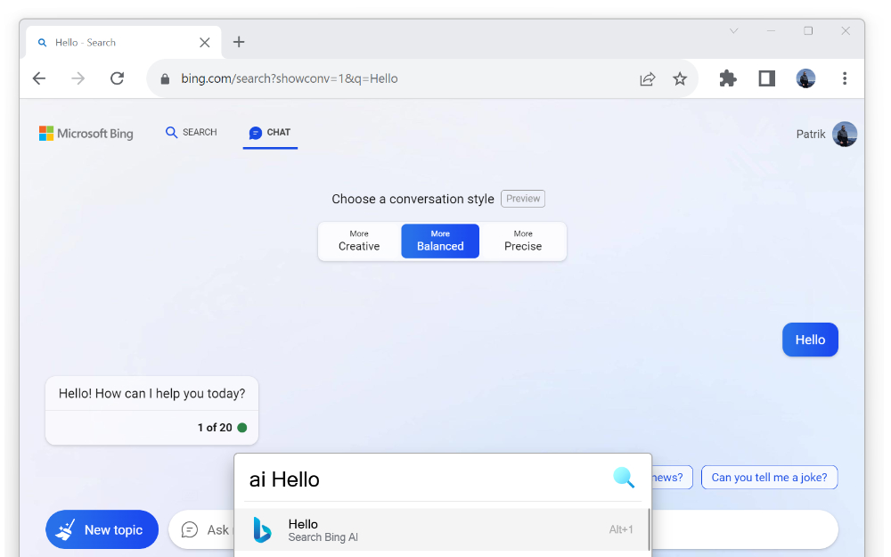

#  [Bing AI Plus](https://chrome.google.com/webstore/detail/bing-ai-plus/fidegdolhcippkeobljodnicbeecghlm)

Adds many features and gives options to the new Bing AI chatbot (ChatGPT v4).

## Browser extensions

[Chrome](https://chrome.google.com/webstore/detail/bing-ai-plus/fidegdolhcippkeobljodnicbeecghlm) | [Firefox](https://addons.mozilla.org/en-US/firefox/addon/bing-ai-plus) |
-- | --
 |  |

## Features

- Ability to automatically fill in and send the query from the URL parameter named 'q'

- Ability to hide (and show) the recent activity sidebar
- Ability to center the chat
- Ability to hide the rewards icon
- Ability to hide the welcome banner
- Ability to hide the examples
- Ability to hide the feedback text and links
- Ability to hide the terms & privacy links
- Ability to hide the color gradient on background
